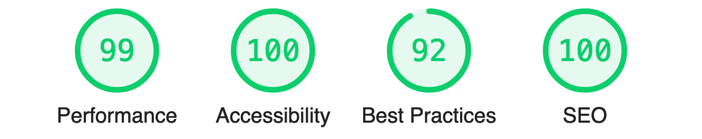

# Scapoli vs Ammogliati

Sito web ([sva.pscanf.com](https://sva.pscanf.com/)) per registrare e consultare
i risultati di calcetto.

Il sito è fatto seguendo l'architettura [JAM Stack](https://jamstack.org/),
facendo uso dei seguenti strumenti:

- **static site generator**:
  [React Static](https://github.com/react-static/react-static)
- **content management system**: file markdown dentro questa repo, oppure
  [Contentful](https://www.contentful.com/)
- **server di continuous integration**: [Circle CI](https://circleci.com/)
- **piattaforma di deploy**: [StaticDeploy](https://staticdeploy.io/)

## Come modificare il sito

Per il setup dell'ambiente di sviluppo:

- assicurarsi di avere installati [nodejs](https://nodejs.org/) e
  [yarn](https://yarnpkg.com/)
- clonare questa repo
- installare le dipendenze con `yarn install`

Poi si può:

- fare partire il server di sviluppo con `yarn dev`
- buildare il sito con `yarn build`

> **Nota:** per caricare i contenuti da Contenful, vanno impostate le seguenti
> variabili d'ambiente:
>
> - `CONTENTFUL_SPACE_ID`
> - `CONTENTFUL_ACCESS_TOKEN`

## Report Lighthouse

## Link utili

- [documentazione dell'architettura JAM Stack](https://jamstack.org/)
- [lista di static site generators](https://www.staticgen.com/)
- [lista di headless CMS](https://headlesscms.org/)
- [tool per la valutazione delle performance di un sito (Lighthouse)](https://web.dev/measure/)
- [repo di React Static](https://github.com/react-static/react-static/)
- [home page Contentful](https://www.contentful.com/)
- [home page CircleCI](https://circleci.com/)
- [home page StaticDeploy](https://staticdeploy.io/)
- [repo StaticDeploy](https://github.com/staticdeploy/staticdeploy/)
